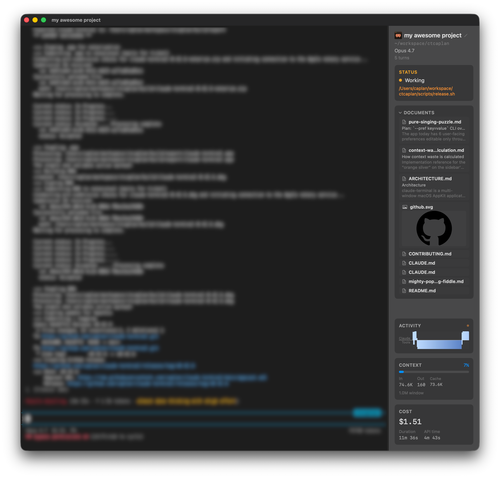

# claude-terminal

A native macOS app for running [Claude Code](https://docs.claude.com/en/docs/claude-code/overview) sessions. Each window is a terminal running Claude Code plus a live sidebar that shows what Claude is doing, what it costs, and what files it's touching. Markdown and image files Claude reads or writes open inline as tabs.

Built on [Ghostty](https://ghostty.org)'s terminal engine.



## Install

1. Download `claude-terminal-X.Y.Z.dmg` from the [latest release](../../releases/latest).
2. Open the DMG and drag **claude-terminal** to `/Applications`.
3. Launch it. Updates arrive automatically via Sparkle.

Requires macOS 14 and the [Claude Code CLI](https://docs.claude.com/en/docs/claude-code/setup):

```bash
npm install -g @anthropic-ai/claude-code
```

## Your first session

When you launch claude-terminal you'll see a directory picker. Pick the project folder you want to work in — that becomes the working directory for Claude Code. A new window opens with:

- The **terminal** on the left, running `claude` in your project.
- The **sidebar** on the right, showing session status, cost, context usage, and anything Claude is currently doing.

Type a prompt in the terminal as you would with `claude` directly. As Claude responds, the sidebar updates in real time.

> Every window is its own Claude session with its own working directory. Open a second project by pressing `Cmd+N`.

## Reading the sidebar

The sidebar is a set of cards. They appear and collapse as they become relevant, so it's not all visible at once.

**Status headline.** The top of the sidebar shows what Claude is doing right now — thinking, running a tool, waiting for input. The current tool name and a short argument summary appear beneath it, tinted by tool type. The most recent italic line of assistant prose surfaces here too, with inline markdown rendered (`**bold**`, `*italic*`, `` `code` ``) instead of raw asterisks.

**Activity chart.** A CPU-style bidirectional bar graph of the last 3 minutes. Claude bars grow up from the centerline, tool bars grow down. Colour ramps light-blue → yellow → orange → red as a single operation stays busy, peaking at red after 30 minutes — useful for spotting a stuck tool call. Hover a tool bar to see which tools ran in that slice.

**Context & cost.** Context-window usage (percent, tokens, cache read/write), cumulative cost, API latency breakdown, and running token counts. Cost and context always stay visible — even when the window is short and other cards collapse to single-line summaries.

**Subagents.** When Claude spawns a subagent (Explore, Plan, etc.), it appears as a row with a coloured status dot, the agent name, the tool it's running, and the argument detail. Right-click a row for **Force Quit**.

**Tasks.** The task list from `TaskCreate`, with dependency ordering. Blocked tasks are marked so you can see why a task isn't progressing.

**Documents.** Any `.md` file or image (PNG, JPG, GIF, SVG, WebP, HEIC, AVIF, …) Claude reads, writes, or edits shows up as a card. Markdown cards show filename + first heading + excerpt; image cards show a live thumbnail.

**Working directory.** Your cwd with a project favicon auto-loaded from the folder. A GitHub icon appears next to it when cwd is inside a git repo *and* GitHub's public status API reports an incident — hover for the summary, click to open status.github.com.

**Jira ticket.** If your branch name or a recent prompt mentions a Jira key (e.g. `ABC-123`), the ticket number and title surface here as a clickable link. Requires a Jira CLI (`ankitpokhrel/jira-cli` or `go-jira`) on PATH.

## Viewing files Claude touches

The Documents section lets you read the same markdown and images Claude is working on, without leaving the app.

- **Click a card** — or drag any `.md` or image onto the sidebar — to open it in a tab that covers the terminal area. The sidebar stays in place.
- **Open from Finder**: right-click a `.md` or image → **Open With → claude-terminal**.

Markdown tabs render full GitHub-flavored markdown — tables, task lists, fenced code with syntax highlighting, and **mermaid diagrams** rendered inline. Each mermaid diagram supports ⌘-scroll zoom, drag-pan, and double-click to reset.

Image tabs support ⌘-scroll zoom and drag-to-pan. They auto-reload on save, so an image regenerated by `convert`, `ffmpeg`, or Photoshop updates live without you touching anything.

`Cmd+F` searches the open document. `Cmd+=` / `Cmd+-` / `Cmd+0` zoom in, out, reset. Scroll position is preserved when you switch tabs or quit and relaunch.

## Running multiple sessions

- `Cmd+N` opens a new session. Pick a different project folder for each one.
- Switch between open windows with the **Window** menu or `Cmd+1` … `Cmd+9`.
- The **menu-bar icon** pops up a grid of all sessions (active and recently used). Click any tile to focus or reopen. You can set the trigger to hover or click, and hide the icon entirely, in **Settings → Menu Bar**.
- `Cmd+Shift+R` renames the current session — helpful when `~/projects/foo` isn't descriptive enough.
- **Right-click the terminal** → **Set Terminal Background Color…** to tint a session for visual distinction at a glance. The tint is per-window, sticks across `/clear`, and also colors the session's tile in the menu-bar popover. Pick **Remove Custom Background** to revert.

## Saving and resuming work

Use **Save & Quit** (from the claude-terminal menu) instead of closing windows individually. On next launch, every window reopens with `--continue` against the same Claude Code session, including any document tabs you had open and their scroll positions.

Window size, position, sidebar width, and renamed session names also persist.

## From the command line

On first launch the app offers to install a symlink at `~/.local/bin/claude-terminal`. After that:

```bash
claude-terminal                              # directory picker
claude-terminal ~/projects/myapp             # open a specific directory
claude-terminal --name "feature work" .      # named session
claude-terminal ~/myapp -- --resume          # pass args through to claude
```

If the app is already running, the CLI opens a new window in the same process rather than launching a second copy.

## Notifications

macOS notifications fire when Claude needs your attention — a permission request, an `AskUserQuestion`, or any other `Notification` hook event from Claude Code. They only fire when the app is in the background, so you won't get double-pinged while you're already looking at it. Toggle them in **Settings → Notifications**.

## Keyboard shortcuts

| Action | Shortcut |
|---|---|
| New session | `Cmd+N` |
| Open session | `Cmd+O` |
| Close window | `Cmd+W` |
| Toggle sidebar | `Cmd+B` |
| Rename session | `Cmd+Shift+R` |
| Switch to window 1–9 | `Cmd+1` … `Cmd+9` |
| Find in terminal / open markdown doc | `Cmd+F` |
| Find next / previous | `Cmd+G` / `Cmd+Shift+G` |
| Zoom markdown in / out / reset | `Cmd+=` / `Cmd+-` / `Cmd+0` |

## Uninstall

**claude-terminal** menu → **Uninstall Claude Terminal…** removes the app from `/Applications`, deletes `~/.claude-terminal/`, strips the claude-terminal hook and statusLine entries from `~/.claude/settings.json`, removes the CLI symlink, and clears app preferences.

If you already dragged the app to Trash without using the menu, the Claude Code hook entries still reference a missing binary. Run the standalone uninstaller the app drops on every launch:

```bash
bash ~/.claude-terminal/uninstall.sh
```

## Contributing

Source layout, build instructions, release process, and architecture notes live under [docs/](./docs/) and [CONTRIBUTING.md](./CONTRIBUTING.md).

## License

[MIT](./LICENSE)
